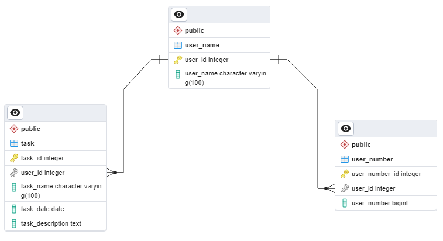

# :pushpin: Gerenciador de Tarefas


<br>
Este é um pequeno protótipo de um simples gerenciador de tarefas, cuja principal função é enviar lembretes das tarefas registradas via mensagem para qualquer operadora.

# :speech_balloon: Sobre <a name="sobre"></a>
<br>
Este projeto é apenas um protótipo para teste, afim de aprimorar ideias e testar funcionalidades para construção e evolução de outras aplicações futuras.

# :seedling:Status do projeto
> :construction: Projeto em construção :construction:

# :hammer: Funcionalidades do projeto

- `Registrar usuário`: Usuário poderá ser registrado com nome e número de celular, podendo registrar mais de um número que não seja da mesma operadora.
- `Adicionar tarefa`: Poderá ser adicionado tarefas incluindo campos como título, data e descrição.
- `Lembrete via mensagem`: Os lembretes serão feitos via mensagem de texto para que o usuário der uma atenção maior para a tarefa registrada.

# :hammer_and_wrench: Configuração do Banco de Dados

> [!NOTE]
> O banco de dados funcionará de forma remota em futuras atualizações.

Este projeto requer um banco de dados para armazenar informações de usuários e tarefas. Embora o banco de dados não esteja incluído no repositório por motivos de segurança, você pode visualizar a estrutura do banco de dados no diagrama abaixo.



A estrutura inclui duas tabelas principais: user_name para armazenar o nome de usuários, user_number para armazenar os números associados aos usuários e task para armazenar informações sobre as tarefas associadas aos usuários.

Certifique-se de criar o banco de dados e as tabelas conforme necessário para o seu ambiente de desenvolvimento. Para instruções detalhadas, consulte a documentação do seu sistema de gerenciamento de banco de dados PostgreSQL.

# :rocket: Abrir e rodar o projeto

> [!NOTE]
> Para executar os comandos a seguir é necessário ter o git instalado na sua máquina

**Clonar o repositório**
<br>
Para clonar o repositório na sua máquina execute o seguinte comando:

```
git clone https://github.com/joaosaiko14/gerenciador-de-tarefas.git

```
**Atualizar repositório**
<br>
É recomendado sempre atualizar o repositório para evitar problemas em caso de mudança, para isso execute o seguinte comando:
```
cd caminho-da-pasta-clonada
git pull origin main

```

**Subir repositório**
<br>
Por fim, ao finalizar as mudanças adicionadas, execute o seguinte comando para atualizar este repositório:
```
cd caminho-da-pasta-clonada
git push origin main

```

# :white_check_mark: Técnicas e tecnologias utilizadas
- ```Java 21```
- ```Eclipse IDE```
- ```postgresSQL 16.1```
- ```Orientação a objeto```

# Autores

| [<br><sub>joaosaiko14</sub>](https://github.com/joaosaiko14) |
| :---: |
